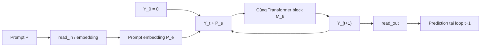
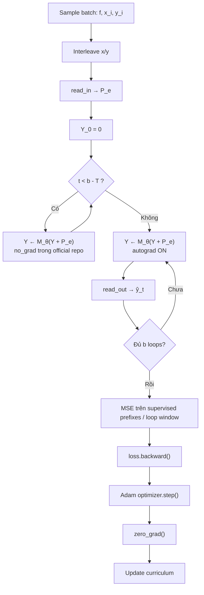
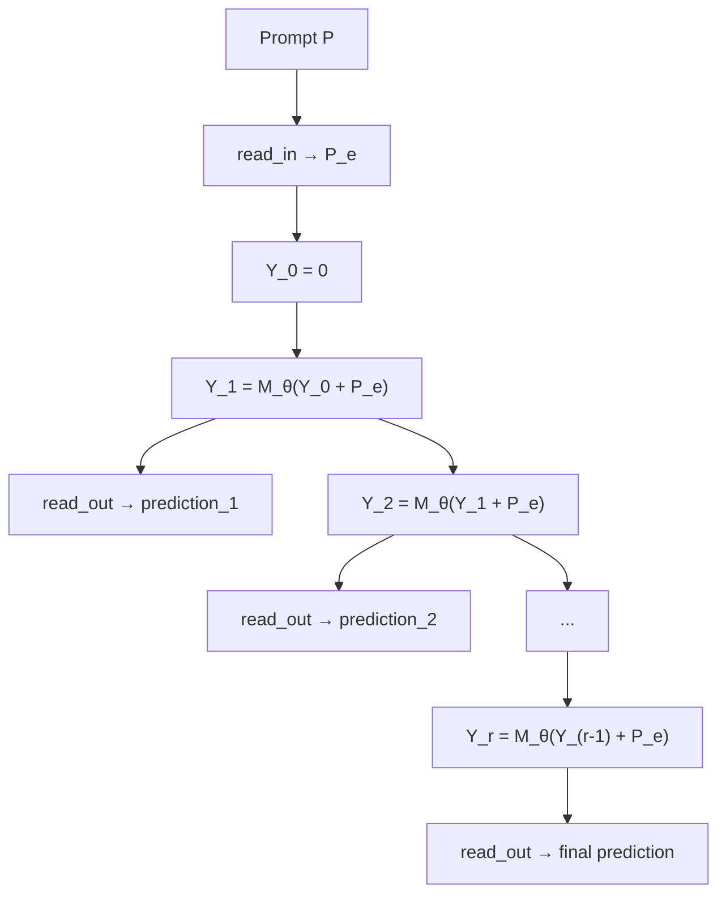
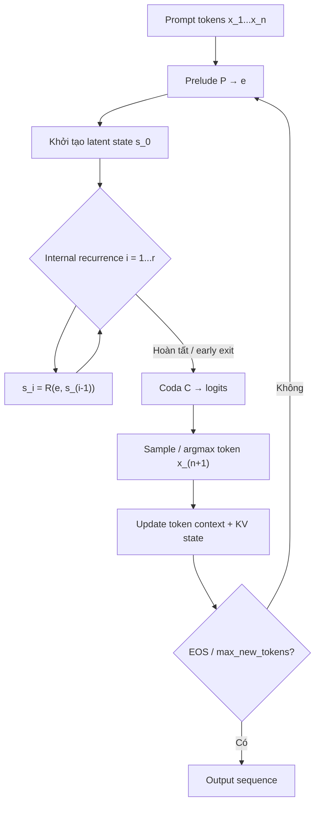

# Loop Transformer: giải thích toàn diện giai đoạn huấn luyện và suy luận

## Tóm tắt điều hành

“**Loop Transformer**” không nên được hiểu là một mô hình duy nhất có một đặc tả chuẩn. Trong tài liệu nghiên cứu hiện nay, tên này chủ yếu chỉ một **họ Transformer có chiều sâu hồi quy** (*recurrent depth*): một hoặc một cụm Transformer block dùng **cùng tham số** được áp dụng lặp lại nhiều lần lên cùng một trạng thái ẩn. Công trình nền tảng của Giannou et al. tại ICML 2023 chứng minh rằng Transformer có số layer cố định, khi đặt trong vòng lặp, có thể mô phỏng các chương trình và thuật toán lặp; Yang et al. tại ICLR 2024 sau đó đưa ra một công thức huấn luyện thực nghiệm rõ ràng cho *looped Transformer* trong in-context learning. citeturn19search0turn21search2turn17academia33

Điểm quan trọng nhất về kiến trúc là phải phân biệt **loop theo chiều sâu** với **recurrence theo chiều chuỗi**. Trong Loop Transformer của Yang et al., cùng một prompt $P$ được giữ cố định và latent state được cập nhật

$$
Y_{t+1}=M_\theta(Y_t+P),\qquad Y_0=0.
$$

Vì vậy, tăng từ $t=10$ lên $t=100$ nghĩa là cho mô hình “suy nghĩ sâu hơn” trên **cùng token positions**, không có nghĩa là context window dài hơn 10 lần. Đây là khác biệt căn bản với Transformer-XL, nơi recurrence mang hidden states từ **segment trước sang segment sau** để kéo dài dependency theo trục thời gian. citeturn21view1turn20view3

Trong bản ICLR 2024, backbone looped chỉ có một GPT-2 decoder layer thay vì 12 layer ở baseline; cấu hình báo cáo dùng hidden size 256 và 8 attention heads, dẫn tới khoảng 0,79 triệu tham số so với 9,48 triệu tham số của Transformer 12-layer, trong khi đạt hiệu năng gần tương đương trên một số bài toán data-fitting/in-context learning tổng hợp. Đây **không phải** là bằng chứng rằng một Loop Transformer 1-layer nói chung thay thế được LLM 12-layer trên NLP thực tế; kết quả đó thuộc phạm vi các task regression, sparse regression, decision tree và neural-network fitting của paper. citeturn17academia33turn20view0

Huấn luyện của Yang et al. dùng một ý tưởng rất quan trọng: **unroll nhiều loop nhưng chỉ backpropagate qua cửa sổ cuối $T$ loop**. Tham số $b$ quy định tổng số lần loop trong một forward pass, còn $T$ quy định chiều sâu gradient. Forward compute vì thế vẫn tăng gần tuyến tính theo $b$, nhưng activation memory dùng cho backward có thể phụ thuộc chủ yếu vào $T$ thay vì $b$. Official repository hiện thực điều này bằng `torch.no_grad()` cho các loop trước cửa sổ gradient. citeturn21view0turn5view2turn7view0

Bản gốc ICLR 2024 dùng Adam với learning rate $10^{-4}$, weight decay bằng 0 và cố ý không dùng các regularizer như gradient clipping; backbone code đặt dropout bằng 0. Paper nhận thấy $T$ quá lớn có thể gây gradient fluctuation/instability, trong khi $T$ quá nhỏ tiết kiệm bộ nhớ nhưng làm chất lượng giảm. Các tác giả cũng ghi nhận clipping, weight decay và mixed precision có thể làm những cấu hình sâu hơn ổn định hơn, nhưng không dùng chúng trong so sánh chính nhằm giữ baseline công bằng. citeturn5view1turn4view3turn20view1

Một nhầm lẫn khác cần tránh: **Loop Transformer ICLR 2024 không phải autoregressive language model được thiết kế để sinh text dài**. Repository gốc nhận một prompt in-context cố định, chạy toàn bộ prompt qua backbone nhiều lần và đọc prediction sau mỗi loop; nó không mô tả KV cache, token-by-token decoding, state carry-over giữa các chunk hay cơ chế mở rộng context. Context vẫn bị giới hạn bởi `block_size`; code đặt nó thành `2 * n_positions + 1`. citeturn20view1turn21view2

Để trả lời phần inference kiểu LLM và KV caching, nguồn phù hợp hơn là thế hệ kế tiếp của ý tưởng này: **recurrent-depth language model Huginn** của Geiping et al. Công trình này dùng ba phần `prelude → recurrent core → coda`, huấn luyện một recurrent block với số lần lặp ngẫu nhiên, pretrain mô hình 3,5B parameter trên khoảng 800B tokens và cho phép tăng số recurrence khi inference. Nó vẫn không tự động biến thành một “long-context model”: recurrence thêm **compute depth**, không thêm token context. citeturn13view0turn13view1turn15view3

Từ góc nhìn hệ thống, Loop Transformer trao đổi **parameter memory lấy sequential compute**:

$$
\text{fixed-depth Transformer}: \quad
\text{params}\propto L,\quad \text{compute}\propto L
$$

trong khi, về trực giác,

$$
\text{looped Transformer}: \quad
\text{params}\propto L_{\text{core}},\quad
\text{compute}\propto rL_{\text{core}}.
$$

Nếu $r$ tăng ở inference, model có thể dùng thêm FLOPs mà không phải nạp thêm một bộ parameter tương ứng; đổi lại, các recurrence phụ thuộc trạng thái trước và về cơ bản là **serial**, do đó latency tăng. Điều này đã trở thành một hướng *test-time compute scaling* độc lập với việc sinh thêm chain-of-thought tokens. citeturn13view0turn13view2

## Kiến trúc và cơ chế loop

Để giữ thuật ngữ chính xác, phần chính của báo cáo gọi mô hình Yang et al. ICLR 2024 là **Loop Transformer gốc**, còn Huginn/Geiping et al. là **recurrent-depth LM** kế thừa cùng nguyên lý.

**Dòng kiến trúc gốc.** Prompt cho một bài toán in-context regression có dạng

$$
P=
(x_1,f(x_1),x_2,f(x_2),\ldots,x_k,f(x_k),x_{\text{test}}),
$$

và model phải dự đoán $f(x_{\text{test}})$. Paper dùng GPT-2 decoder làm backbone; baseline bình thường có $L=12$ Transformer layers, còn phiên bản looped mặc định có $L=1$ rồi gọi lại cùng layer/block nhiều lần. citeturn20view0

Official code còn cho thấy rõ cách biểu diễn dữ liệu: `xs` và `ys` được `_combine()` xen kẽ thành chuỗi dạng $[x_1,y_1,x_2,y_2,\ldots]$, sau đó `read_in` project chúng sang hidden dimension. Sau backbone, `read_out` project hidden vectors xuống scalar/class logits; đối với regression chỉ những vị trí tương ứng với $x_i$ được lấy làm prediction. citeturn21view2

Mô hình lặp trạng thái theo

$$
\boxed{Y_{t+1}=M_\theta(Y_t+P_e)}
$$

trong đó $P_e$ là biểu diễn embedding của prompt và $Y_0=0$. Cùng $\theta$ được dùng ở tất cả $t$, nên unroll 30 lần tương đương một computational graph có effective depth lớn hơn nhưng **không nhân 30 số parameter của recurrent block**. citeturn21view1turn17academia33

Điểm `+P_e` gọi là **input injection**. Phiên bản weight tying đơn giản

$$
Y_{t+1}=M_\theta(Y_t),\qquad Y_0=P_e
$$

có nguy cơ làm ảnh hưởng của prompt ban đầu mờ dần qua nhiều iteration; Yang et al. báo cáo rằng việc inject lại input ở mọi loop làm extrapolation ra số loop lớn hơn ổn định hơn đáng kể. Input injection không bắt buộc phải là phép cộng, nhưng phép cộng là lựa chọn của architecture gốc. citeturn21view1



**Self-attention không được thay bằng một loại attention mới trong bản gốc.** Nếu hidden matrix tại một loop là $H$, attention cơ bản vẫn có

$$
Q=HW_Q,\qquad K=HW_K,\qquad V=HW_V
$$

và

$$
\operatorname{Attention}(Q,K,V)
=
\operatorname{softmax}
\left(
\frac{QK^\top}{\sqrt{d_k}}+M_{\text{causal}}
\right)V .
$$

Official implementation dựa trên NanoGPT/GPT-2, dùng causal scaled-dot-product self-attention; nếu PyTorch hỗ trợ thì gọi `scaled_dot_product_attention`, nếu không thì thực hiện masked softmax theo cách thông thường. citeturn9view0turn20view2

Backbone cũng giữ cấu trúc Transformer block kiểu pre-normalization:

$$
H' = H + \operatorname{Attn}(\operatorname{LN}(H)),
$$

$$
H''=H'+\operatorname{MLP}(\operatorname{LN}(H')).
$$

Do đó “loop” nằm **bên ngoài Transformer block**, chứ không phải một thay đổi bên trong phép attention. citeturn9view0

**Positional encoding.** Code gốc dùng learned GPT-2 absolute positional embeddings. Vị trí được tạo bằng `arange(0,t)` và positional embedding được cộng vào `inputs_embeds` bên trong GPT backbone. Vì mỗi loop lại gọi backbone bằng `inputs_embeds=output + embeds`, backbone xử lý lại cùng token positions ở mỗi recurrence. Không có RoPE, relative-position scheme kiểu Transformer-XL hay position index tăng lên theo loop trong implementation này. citeturn8view8turn20view1

Điều này dẫn tới một cách hình dung hữu ích:

$$
\underbrace{\text{token position}}_{\text{trục ngang}}
\neq
\underbrace{\text{loop index}}_{\text{trục sâu}}.
$$

Token thứ 20 vẫn là token thứ 20 ở loop 1, loop 10 hay loop 100; model chỉ tiếp tục biến đổi latent representation tại vị trí đó. citeturn21view1

Một hướng tiếp nối năm 2026, **Fully Looped Transformer**, lập luận rằng các loop rất sâu có thể gặp gradient oscillation và residual-state explosion. Kiến trúc đó cho previous-loop output đi vào mọi layer:

$$
h_l^{(t)}
=
f_\theta^{(l)}
\left(
h_{l-1}^{(t)},h_L^{(t-1)}
\right),
$$

và đề xuất *Attention Injection*, trong đó previous-loop state đóng vai trò query còn current-loop states tạo key/value. Đây là **mở rộng về sau, không thuộc Loop Transformer ICLR 2024**. citeturn4view5turn4view6

## Giai đoạn huấn luyện từng bước

Với Loop Transformer gốc, một training step có thể được hiểu chính xác như sau.

1. **Sinh một mini-batch bài toán.** Với mỗi sample, framework lấy một hàm $f$ từ task distribution, lấy các $x_i$, tính $y_i=f(x_i)$, rồi tạo prompt chứa các cặp in-context examples cùng query cần dự đoán. Paper đánh giá linear regression, sparse linear regression, decision trees, ReLU neural networks và một số OpenML data; đây không phải next-token pretraining corpus. citeturn20view0turn3view1

2. **Xây dựng các prefix supervision.** Thay vì chỉ giám sát query cuối, paper định nghĩa các prefix $P^i$, nghĩa là model được yêu cầu dự đoán $f(x_{i+1})$ sau khi đã thấy $i$ ví dụ. Điều này cung cấp supervision ở nhiều vị trí của prompt. citeturn21view0

3. **Interleave và project dữ liệu.** Official code ghép `xs` với `ys`, tạo tensor gần dạng `[B, 2n, d_in+1]`, rồi `read_in` đưa tensor sang embedding dimension $D$. `block_size` được cấu hình là `2*n_positions + 1`. citeturn21view2turn20view1

4. **Khởi tạo loop state.**

$$
Y_0=0.
$$

Đây là điểm khác với một vanilla Transformer: input embedding không đơn giản chỉ đi qua stack layer một lần. Prompt embedding được giữ lại để inject vào tất cả recurrence. citeturn21view1

5. **Unroll $b$ lần.** Tại mỗi loop,

$$
Y_{t+1}=M_\theta(Y_t+P_e).
$$

Sau mỗi lần, `read_out(Y_t)` có thể tạo prediction. Toàn bộ $b$ recurrence dùng chung $\theta$. citeturn21view1turn7view0

6. **Chỉ giữ gradient qua cửa sổ cuối $T$ recurrence.** Với

$$
b_0=\max(b-T,0),
$$

paper tối ưu loss trên các loop gần cuối. Official repository thực hiện đoạn trước `n_loop_start = max(0, n_loops - n_loop_window)` trong `torch.no_grad()`, rồi bật autograd ở các recurrence còn lại. Đây chính là truncated backpropagation through depth, tương tự truncated BPTT nhưng trục recurrence là **depth**, không phải token time. citeturn5view0turn7view0

7. **Tính loss.** Viết gọn tập loop được giám sát là

$$
\mathcal W_b=
\{t\mid \max(b-T,0)\le t\le b\},
$$

thì mục tiêu là

$$
\boxed{
\mathcal L(\theta)
=
\mathbb E_P
\left[
\frac{1}{|\mathcal W_b|}
\sum_{t\in\mathcal W_b}
\frac{1}{k+1}
\sum_{i=0}^{k}
\left(
\hat y_t(P^i)-f(x_{i+1})
\right)^2
\right].
}
$$

Tức là model không chỉ cần đáp án cuối cùng đúng; các iterates cuối của vòng lặp đều được thúc đẩy về prediction tốt. citeturn5view0

8. **Backward qua đồ thị unrolled cuối.** Vì một parameter tensor $\theta$ xuất hiện ở nhiều recurrence, gradient là tổng các contribution từ tất cả lần sử dụng nó trong cửa sổ:

$$
\nabla_\theta\mathcal L
=
\sum_{t=b_0}^{b}
\frac{\partial \mathcal L}{\partial Y_t}
\frac{\partial Y_t}{\partial\theta},
$$

với chain rule đi ngược qua các recurrent applications của $M_\theta$. Các recurrence trước cửa sổ bị detach/no-grad trong implementation, nên không giữ activation graph cho chúng. citeturn7view0turn5view0

9. **Optimizer update.** Paper gốc báo cáo Adam, learning rate $10^{-4}$, weight decay $0$, không dùng explicit gradient clipping/data augmentation trong thí nghiệm chính. Official training implementation cũng tạo Adam optimizer trực tiếp; không có learning-rate scheduler được chỉ định trong recipe chính của paper, vì vậy **learning-rate decay schedule của Loop Transformer gốc: không được chỉ định như một thành phần của phương pháp**. citeturn5view1turn8view0

10. **Xóa gradient và cập nhật curriculum.** Repository gọi `optimizer.step()` rồi `optimizer.zero_grad(set_to_none=True)`. Training framework còn tăng độ khó của task theo curriculum, chẳng hạn tăng dimension, số in-context points và số loop; curriculum về dimension/point kế thừa setup của Garg et al. citeturn9view1turn4view2

Luồng tổng thể:



Có một nuance implementation đáng lưu ý: paper mô tả trực tiếp một **truncated loss window**, trong khi repository có thể tạo predictions ở nhiều loop và sử dụng `no_grad` ở phần đầu. Vì các output trước cửa sổ đã detach khỏi $\theta$, chúng không đóng góp gradient; khác biệt chủ yếu nằm ở cách biểu diễn/tỷ lệ loss trong code chứ không tạo đường gradient xuyên qua các recurrence đã cắt. citeturn7view0turn9view1

**Trade-off giữa $b$ và $T$.** Tăng $b$ cho model nhiều bước iterative computation hơn và có thể làm trạng thái đạt vùng ổn định/fixed point tốt hơn, nhưng forward latency và tổng FLOPs tăng. Tăng $T$ cho gradient đi qua một chuỗi recurrence dài hơn, thường cải thiện learning signal nhưng tăng activation memory và có thể gây instability. Paper quan sát $T$ quá nhỏ làm MSE xấu hơn, trong khi $T$ lớn có thể làm gradient dao động; $b=20,T=15$ là một lựa chọn hiệu quả cho một thiết lập linear-regression chính, nhưng **không phải hyperparameter chung cho mọi task**. citeturn5view2turn4view4

Official experiment scripts thực tế dùng các giá trị khác nhau theo task, chẳng hạn có cấu hình linear dùng $b=30,T=15$, sparse regression $b=20,T=10$, decision tree $b=70,T=15$, và ReLU network $b=12,T=5$. Điều này củng cố rằng loop depth phải được tune theo bài toán. citeturn9view3

**Batching.** Base configuration trong repository có ví dụ `batch_size=64`, embedding size 256, một looped layer và 8 heads; đây là repository default/configuration chứ không nên được coi là invariant của kiến trúc. Không có cơ chế chunking sequence hoặc recurrent state carry-over giữa mini-batches trong Loop Transformer gốc: mỗi batch xây một prompt riêng và `Y_0` được khởi tạo lại. citeturn8view4turn8view5

**Mixed precision.** Repository có đường chạy `autocast`/GradScaler cho float16, còn paper chính không đưa mixed precision thành một thành phần cốt lõi của thuật toán. Code cũng tính gradient norm để logging, nhưng trong đường huấn luyện được công bố không dùng norm đó để gọi gradient clipping trước optimizer step. citeturn8view0turn9view1

Một pseudocode gần sát paper là:

```python
# Pseudocode — Loop Transformer ICLR 2024

optimizer = Adam(model.parameters(), lr=1e-4, weight_decay=0.0)

for xs, ys in train_loader:
    prompt = interleave(xs, ys)
    p = read_in(prompt)

    b = current_num_loops
    T = loop_loss_window
    start = max(0, b - T)

    state = zeros_like(p)
    supervised_predictions = []

    # Forward-only prefix: compute state but do not retain graph.
    for t in range(start):
        with no_grad():
            state = transformer_block(state + p)

    # Truncated unroll retained for backward.
    for t in range(start, b):
        state = transformer_block(state + p)
        pred = read_out(state)
        supervised_predictions.append(pred)

    loss = mean_squared_error_over_prefixes_and_loops(
        supervised_predictions, ys
    )

    optimizer.zero_grad(set_to_none=True)
    loss.backward()
    optimizer.step()
```

Pseudocode trên diễn đạt trực tiếp công thức paper; official repository có một số khác biệt tổ chức tensor nhưng dùng cùng cơ chế input injection, unrolling và `no_grad` trước gradient window. citeturn21view1turn7view0

Về complexity, giả sử một recurrent Transformer block dùng full attention trên $n$ token với hidden size $d$, chi phí attention thô cho $b$ loop là xấp xỉ

$$
O(bn^2d),
$$

trong khi số parameter của recurrent block không tăng theo $b$. Với truncated backward window $T$, activation storage gắn với recurrent-depth graph có thể giảm từ quy mô $O(b)$ recurrence xuống khoảng $O(T)$ recurrence, mặc dù **forward compute vẫn phải chạy $b$ lần**. Đây chính là lợi ích và cái giá cốt lõi của phương pháp. citeturn5view2turn7view0

## Giai đoạn suy luận từng bước

Trước hết cần tách **inference của paper gốc** và **autoregressive LLM inference của các recurrent-depth model sau này**.

Đối với Loop Transformer ICLR 2024:

1. **Tạo prompt hoàn chỉnh.** Model nhận các in-context examples và query $x_{\text{test}}$ giống lúc train. Không có bước “prefill prompt rồi decode token” như LLM chat thông thường. citeturn20view0

2. **Encode toàn bộ prompt một lần về mặt dữ liệu.** `xs/ys → _combine → read_in` tạo prompt embedding $P_e$. Positional indices vẫn là vị trí token thông thường trong prompt. citeturn21view2turn8view8

3. **Khởi tạo recurrent state bằng zero:**

$$
Y_0=0.
$$

Không carry state từ một request trước, batch trước hay chunk trước. citeturn21view1

4. **Chạy recurrent block tuần tự.**

$$
Y_1=M_\theta(P_e),
$$

$$
Y_2=M_\theta(Y_1+P_e),
$$

$$
\ldots
$$

$$
Y_r=M_\theta(Y_{r-1}+P_e).
$$

Mỗi $Y_t$ phụ thuộc vào $Y_{t-1}$, nên các loop không thể đơn giản được parallelize theo depth giống một batch các forward pass độc lập. citeturn21view1

5. **Đọc prediction sau mỗi loop hoặc ở loop cuối.** Paper quan sát ở một số task rằng model được huấn luyện tốt có thể tiếp tục cải thiện hoặc tiến tới trạng thái tương đối ổn định khi chạy nhiều loop hơn mức điển hình trong training. Tuy nhiên đây là kết quả thực nghiệm theo task, **không phải bảo đảm hội tụ toán học cho mọi prompt hay mọi số recurrence**. citeturn3view0turn5view2

6. **Chọn stopping rule.** Bản gốc chủ yếu dùng một loop budget định trước; không đưa adaptive stopping rule chuẩn hóa cho production inference. Vì vậy adaptive convergence threshold của bản gốc là **unspecified**. citeturn3view0

7. **Trả prediction.** Với regression, output là scalar tương ứng vị trí query. Không có sampling temperature, top-p hoặc next-token sampling vì model này không phải generative LM. citeturn20view0turn21view2



**KV caching trong model gốc: không được đặc tả và không phải cơ chế inference của repository gốc.** Cùng toàn bộ prompt đi qua attention lại ở mỗi recurrence, và hidden vectors thay đổi từ loop này sang loop khác; do đó $K_t,V_t$ được sinh từ latent state mới và không thể mặc nhiên coi cache của loop $t-1$ là cache chính xác của loop $t$. Official code path được công bố gọi full backbone cho mỗi loop và không trình bày một `past_key_values`-style interface. citeturn7view0turn9view0

**Context window cũng không tăng theo loop count.** Code kiểm soát sequence bằng GPT-style `block_size`, được đặt thành `2*n_positions+1`. Nếu prompt vượt giới hạn positional/block configuration, chạy thêm recurrence không giúp model “nhìn thấy” token ngoài window. citeturn20view1turn8view8

Vì vậy, đối với câu hỏi “Loop Transformer gốc sinh chuỗi dài thế nào?”, câu trả lời chính xác là: **không được đặc tả; use case đó nằm ngoài model của Yang et al.** Số loop dài là *long computation*, không phải *long sequence*. citeturn17academia33

### Recurrent-depth language model và sinh token

Để biến nguyên lý loop thành một causal LM thực thụ, Geiping et al. sử dụng kiến trúc:

$$
e=P(x),
$$

$$
s_0\sim\mathcal N(0,\sigma^2I),
$$

$$
s_i=R(e,s_{i-1}),\qquad i=1,\ldots,r,
$$

$$
p=C(s_r),
$$

trong đó $P$ là **prelude**, $R$ là recurrent block dùng chung weight, còn $C$ là **coda + language-model head**. citeturn15view3turn14view0

Kiến trúc scale lớn của paper dùng cấu trúc layer $(2,4,2)$: hai prelude layers, bốn layers trong recurrent core và hai coda layers; mean recurrence đặt quanh 32. Model có khoảng 3,5B parameters dù effective computation depth có thể cao hơn nhiều nhờ chạy core lặp lại. citeturn14view1

Inference autoregressive khi đó có **hai vòng lặp lồng nhau**:



Một implementation-level abstraction sẽ giống:

```python
# Pseudocode — recurrent-depth autoregressive LM

tokens = tokenize(prompt)

while not stopping_condition(tokens):
    # Outer loop = autoregressive token dimension
    encoded, cache = prelude(tokens, cache=cache)

    state = initialize_recurrent_state(encoded)

    # Inner loop = latent reasoning / recurrent depth
    for depth in range(recurrence_budget):
        new_state, cache = recurrent_core(
            encoded,
            state,
            cache=cache,
        )

        if adaptive_exit(state, new_state):
            state = new_state
            break

        state = new_state

    logits, cache = coda(state, cache=cache)
    next_token = sample(logits[:, -1])
    tokens.append(next_token)

return detokenize(tokens)
```

Code release của Huginn cung cấp cả pretraining lẫn inference implementation; repository chỉ rõ `recpre/model_dynamic.py`, `train.py` và một HF-compatible implementation `recpre/raven_modeling_minimal.py`, đồng thời về sau hỗ trợ vLLM inference. citeturn13view1

Ở đây mới xuất hiện những câu hỏi thực sự về **latency và KV cache**. Standard decoding phải chạy $r$ recurrent steps tuần tự **trước khi phát token tiếp theo**, vì vậy tăng recurrent depth có xu hướng làm time-to-next-token tăng gần với số recurrence nếu các yếu tố khác giữ cố định. Một nghiên cứu inference sau đó mô tả đây là bottleneck chính của recurrent-depth autoregressive models. citeturn13view2

Geiping et al. còn đưa ra **adaptive compute**: so sánh distribution ở hai recurrence liên tiếp bằng KL divergence và dừng khi divergence xuống dưới $5\times10^{-4}$ trong thí nghiệm minh họa. Như vậy token “dễ” có thể cần ít latent computation hơn token “khó”. Đây là chức năng của Huginn, **không thuộc model ICLR 2024 ban đầu**. citeturn15view1turn15view2

Đối với cache, một recurrence-naive implementation có thể phải lưu KV cho nhiều depth × nhiều token, gây memory gần tỷ lệ với $nr$. Huginn cho thấy có thể dùng **KV-cache sharing**: các recurrent steps sử dụng cùng K/V projection weights nên implementation có thể giữ/ghi đè một budget cache hữu hạn; paper mô tả circular indexing `i mod k` cho budget $k$. citeturn15view2

Một follow-up về efficient parallel sampling báo cáo rằng Huginn-0125 vẫn có thể giữ baseline GSM8K performance với KV sharing có cache-size tối thiểu bằng 1 trong thí nghiệm của họ, qua đó giảm recurrent KV-state memory khoảng $r$ lần và đưa memory cache về cùng bậc với một parameter-matched fixed-depth Transformer. Đây là kết quả của **một inference follow-up cụ thể**, không nên suy rộng thành bảo đảm cho mọi recurrent-depth model. citeturn13view2

Với long generation, outer autoregressive loop vẫn có thể tiếp tục:

$$
x_{n+1},x_{n+2},\ldots,x_{n+T},
$$

nhưng recurrent-depth chỉ tăng phép tính trước mỗi $x_{n+t}$. Huginn pretraining pack dữ liệu vào sequences dài 4096 tokens; paper không chứng minh rằng recurrence tự nó loại bỏ context limit này. Do đó, nếu cần context dài hơn, vẫn phải giải quyết positional encoding, context window hoặc attention/cache architecture giống các LLM khác. citeturn14view1

## Tối ưu hóa, bộ nhớ và tính ổn định

Một cách tách chi phí hữu ích là xem mỗi Transformer block có cost $C_{\text{block}}(n,d)$. Khi attention là dense,

$$
C_{\text{block}}\approx
O(n^2d)+O(nd^2).
$$

Nếu recurrent core chứa $L_R$ layer và chạy $r$ lần:

$$
C_{\text{recurrent}}
\approx
rL_R C_{\text{block}}(n,d).
$$

Vậy loop **không làm full attention trở thành linear-time attention**. Nó chỉ tái sử dụng parameter của cùng block qua chiều sâu. Đây là lý do Loop Transformer và Longformer/Reformer giải quyết hai bài toán khác nhau. citeturn21view1turn20view4

Về parameter memory,

$$
M_{\text{param, loop}}
\approx M_P+M_R+M_C,
$$

không phải

$$
M_P+rM_R+M_C.
$$

Nhưng activation của mọi recurrence cần cho full BPTT sẽ tăng theo $r$; truncated BPTT hoặc gradient checkpointing là cách tách parameter saving khỏi activation explosion. Yang et al. dùng gradient window $T$, còn Huginn backpropagate chỉ qua **8 recurrent iterations cuối** trong large-scale experiment. citeturn5view2turn16view0

Huginn còn randomize recurrent depth trong training để model không chỉ học một “độ sâu thần kỳ” duy nhất. Objective là

$$
\mathcal L(\theta)
=
\mathbb E_{x\sim X}
\mathbb E_{r\sim\Lambda}
L(m_\theta(x,r),x'),
$$

với $x'$ là next-token targets và $r$ được lấy từ một Poisson–lognormal mixture. Paper dùng

$$
\tau
\sim
\mathcal N
\left(
\log\bar r-\frac{1}{2}\sigma^2,\sigma
\right),
\qquad
r\sim\mathcal P(e^\tau)+1,
$$

với $\sigma=\tfrac12$. Phân phối heavy-tailed này thỉnh thoảng tạo training examples với recurrence sâu hơn nhiều mức trung bình. citeturn16view0turn16view4

Khi distributed training, Huginn lấy **một $r$ chung cho toàn micro-batch và đồng bộ nó giữa workers** để worker có recurrence thấp không phải idle chờ worker có recurrence cao. Đây là một implementation consideration đặc thù của variable-depth model mà vanilla fixed-depth Transformer không có. citeturn15view0

Bản large-scale dùng sequences được pack về length 4096, mean recurrence khoảng 32 và bfloat16 mixed precision. Gradient checkpointing được thực hiện ở granularity từng recurrent iteration; nhờ weight sharing làm parameter count tương đối nhỏ so với FLOP footprint, nhóm tác giả có thể dùng data parallel + optimizer sharding thay vì bắt buộc tensor parallel trên recurrent block. citeturn14view1turn15view0

Đối với optimizer của Huginn, nguồn paper cần đọc hơi thận trọng: phần optimizer mô tả Adam với decoupled weight regularization, $\beta_1=0.9,\beta_2=0.95$, update clipping, gradient norm clip ở 1 và warm-up 4096 steps sau đó constant LR. Tuy nhiên chính paper về sau mô tả successful “Main” run đã phải giảm peak learning rate xuống $4\times10^{-5}$, trong khi phần optimizer phía trước ghi giá trị $5\times10^{-4}$. Vì hai đoạn trong source không hoàn toàn nhất quán, **không nên khẳng định $5\times10^{-4}$ là LR cuối cùng của Huginn-0125**; cấu hình/repository của checkpoint cụ thể nên được xem là source of truth khi tái lập run. citeturn15view0turn16view4

Đây cũng minh họa một điểm quan trọng: recurrent-depth model nhạy hơn fixed-depth model với initialization và normalization. Huginn báo cáo các run thất bại do token representations dần trở nên tương quan gần 1 qua recurrence, tức trạng thái các token bị “trộn” đến mức collapse; một run khác học cách bỏ qua recurrent state nên thêm recurrence không cải thiện perplexity. Cấu hình thành công cần điều chỉnh normalization, embedding scale, adapter, initialization và learning rate. citeturn16view4

Đối với Loop Transformer gốc, regularization lại rất tối giản: dropout 0, weight decay 0, không clipping trong thí nghiệm chính. Paper nhận thấy input injection và lựa chọn hợp lý của $b,T$ đủ để ổn định những thí nghiệm chính, nhưng $T$ lớn hơn có thể gặp gradient fluctuation; appendix cho thấy weight decay/mixed precision/gradient clipping có thể giúp khi đẩy loop window sâu hơn. citeturn20view1turn4view4

Từ góc độ kỹ sư, có thể tóm tắt trade-off:

$$
\boxed{
\text{parameter efficiency}
\longleftrightarrow
\text{more serial FLOPs}
}
$$

và

$$
\boxed{
T\uparrow
\Rightarrow
\text{better long-depth credit assignment}
+
\text{higher activation memory/stability risk}.
}
$$

Trong khi

$$
\boxed{
b\uparrow
\Rightarrow
\text{more iterative reasoning capacity}
+
\text{higher forward/inference latency}.
}
$$

Các quan sát ablation của Yang et al. trực tiếp phù hợp với hai quan hệ này. citeturn5view2turn4view4

Nghiên cứu sau này cho thấy vấn đề stability không hoàn toàn được giải quyết chỉ bằng normalization. Fully Looped Transformer 2026 xác định gradient oscillation và residual explosion ở các loop sâu, rồi đề xuất đưa previous-loop state vào từng layer và dùng attention injection; paper báo cáo kiến trúc mới ổn định hơn các baseline khi tăng loop depth trong các setting họ thử nghiệm. Vì đây là follow-up 2026, nên coi nó là bằng chứng rằng stability của deep recurrence vẫn là một vấn đề nghiên cứu mở, không phải một thuộc tính đã được “giải quyết” trong kiến trúc 2024. citeturn4view5turn4view6turn4view7

## So sánh với Transformer và các mô hình long-context

Một Loop Transformer **không phải mặc nhiên là long-context Transformer**. Standard Transformer, Longformer, Reformer và Transformer-XL chủ yếu thay đổi cách token tương tác hoặc cách quá khứ được giữ; Loop Transformer thay đổi cách **cùng computation được lặp theo chiều sâu**. citeturn20view6turn20view3turn20view4

| Mô hình | Cơ chế cốt lõi | Compute attention / context | Memory | Latency inference | Trade-off chất lượng |
|---|---|---|---|---|---|
| **Standard Transformer** | $L$ layer độc lập, full self-attention; không có depth recurrence | Khoảng $O(Ln^2)$ cho dense attention | Parameters và training activations tăng theo depth $L$; autoregressive KV cache thường có state riêng theo layer | Fixed depth, dễ tối ưu kernel; phải đi tuần tự qua $L$ layers | Baseline mạnh, nhưng fixed parameter/depth budget; paper gốc nhấn mạnh tính parallelizable hơn RNN/CNN. citeturn20view6 |
| **Loop Transformer, Yang et al.** | Một/cụm block dùng chung weight, $Y_{t+1}=M(Y_t+P)$ | Khoảng $O(bn^2)$ nếu dùng dense attention | Parameter memory không tăng theo $b$; truncated backward khiến recurrent activation graph phụ thuộc chủ yếu $T$ | $b$ loop phụ thuộc tuần tự → latency tăng với loop count | Trên synthetic ICL, có thể match Transformer sâu với <10% parameter trong setting paper; không có bằng chứng tương đương tổng quát cho NLP. citeturn17academia33turn5view2 |
| **Recurrent-depth LM / Huginn** | `prelude → shared recurrent core × r → coda` | Dense-attention cost nhân theo recurrence $r$ | Parameter-efficient theo effective depth; KV memory có thể giảm bằng cache sharing | Standard AR decoding chậm hơn khi $r$ lớn; adaptive exit/cache sharing giúp giảm cost | Hard reasoning có thể hưởng lợi từ tăng test-time recurrence; mức saturation phụ thuộc task. citeturn15view1turn15view2 |
| **Transformer-XL** | Segment-level recurrence + relative positional encoding | Current segment attention vào current + cached memory; phụ thuộc segment và memory lengths | Phải giữ layer-wise memory từ segment trước | Được thiết kế đặc biệt để reuse quá khứ; paper báo cáo evaluation speed lớn hơn vanilla baseline trong setup của họ | Thực sự mở rộng temporal dependency; paper báo cáo cải thiện perplexity và sinh text hàng nghìn token. citeturn20view3 |
| **Longformer** | Sliding-window sparse attention + một số global-attention tokens | Xấp xỉ $O(nw+ng)$, gần tuyến tính nếu window/global count cố định | Sparse attention tránh ma trận $n^2$ đầy đủ | Phù hợp long-document processing hơn dense Transformer | Đánh đổi global all-to-all attention lấy local+selected global connectivity; được thiết kế cho long-document tasks. citeturn11search1turn20view4 |
| **Reformer** | Locality-sensitive hashing attention + reversible residual layers | LSH attention khoảng $O(n\log n)$ trong formulation của paper | Reversible layers giảm nhu cầu lưu activations theo depth | Có overhead hashing/bucketing; lợi ích lớn nhất khi sequence dài và memory là bottleneck | Approximate routing giảm cost của full attention; paper cho thấy memory saving mà không nhất thiết làm mất accuracy trong các experiment của họ. citeturn11search0turn21search0 |

Các con số accuracy của bảng **không phải benchmark head-to-head**. Transformer-XL, Longformer, Reformer và Loop Transformer được đánh giá trên datasets/tasks, model sizes và training budgets khác nhau; vì vậy không có cơ sở để sắp hạng “Loop Transformer chính xác hơn Longformer” theo một con số phổ quát. citeturn20view3turn17academia33

Transformer-XL là đối chứng đặc biệt hữu ích. Nó dùng

$$
\text{segment}_{j-1}
\longrightarrow
\text{memory for segment}_j,
$$

nên tăng phạm vi dependency dọc sequence. Loop Transformer lại làm

$$
Y_0(P)\rightarrow
Y_1(P)\rightarrow
Y_2(P)\rightarrow\cdots
$$

trên cùng $P$. Hai loại “recurrence” hoạt động trên hai trục khác nhau. citeturn20view3turn21view1

Longformer giải quyết một vấn đề khác nữa: thay vì chạy full $n\times n$ attention, nó hạn chế connectivity về sliding window và global tokens, nên có thể đưa sequence dài hơn vào cùng memory budget. Loop Transformer gốc vẫn chạy GPT-style dense causal attention ở mỗi recurrence, vì vậy tăng loop count thực tế còn **nhân chi phí attention**, chứ không giảm nó. citeturn20view4turn9view0

Reformer dùng hai kỹ thuật orthogonal với looping: LSH để approximate attention và reversible residual network để giảm activation memory. Về nguyên tắc, “looping” và “efficient attention” không loại trừ nhau; có thể thiết kế recurrent-depth core sử dụng sparse/approximate attention. Tuy nhiên đó sẽ là một kiến trúc lai mới, không phải cấu hình được xác định bởi Yang et al. citeturn21search0turn21view1

Một follow-up tên **Parallel Loop Transformer** nhắm thẳng vào latency của serial loops, đưa ra cross-loop parallelism và các cơ chế chia sẻ representation/cache nhằm song song hóa nhiều computation hơn. Sự tồn tại của hướng nghiên cứu này phản ánh bottleneck cơ bản: weight sharing làm Loop Transformer parameter-efficient nhưng recurrence dependency làm nó kém thuận lợi cho low-latency serving nếu chỉ thực hiện vòng lặp tuần tự. citeturn3view4turn13view2

## Góc nhìn triển khai và các công trình phân tích

Ở mức API, core Loop Transformer có thể nhỏ đến mức gần như chỉ cần một `for` loop quanh Transformer block:

```python
class LoopedTransformer(nn.Module):
    def __init__(self, read_in, block, read_out):
        super().__init__()
        self.read_in = read_in
        self.block = block      # shared parameters
        self.read_out = read_out

    def forward(self, prompt, num_loops, grad_window=None):
        p = self.read_in(prompt)
        state = torch.zeros_like(p)

        start = (
            0 if grad_window is None
            else max(0, num_loops - grad_window)
        )

        predictions = []

        for t in range(num_loops):
            if self.training and t < start:
                with torch.no_grad():
                    state = self.block(state + p)
            else:
                state = self.block(state + p)

            predictions.append(self.read_out(state))

        return predictions
```

Đây là essence của official implementation: `read_in`, một GPT-2-style shared backbone, `read_out`, zero recurrent state và `output + embeds` ở mỗi loop. citeturn20view1turn7view0

Một production implementation cần phân biệt bốn loại state:

| State | Loop Transformer gốc | Recurrent-depth LM |
|---|---|---|
| **Input representation** | $P_e$, giữ cố định và inject mỗi loop | $e=P(x)$, condition cho recurrent core |
| **Recurrent latent state** | $Y_t$, zero-init | $s_t$, Huginn dùng random initialization theo thiết kế |
| **Sequence state giữa token/chunk** | Không được định nghĩa | Causal context/KV cache như LM |
| **Optimizer/gradient state** | Adam + activations của $T$ loop cuối | Adam-family optimizer + truncated recurrence + checkpointing |

Các đặc tả này đến trực tiếp từ hai dòng model khác nhau; trộn chúng với nhau sẽ dễ tạo ra một model “giả” không tương ứng paper nào. citeturn21view1turn14view0turn16view0

Đặc biệt, **đừng implement KV cache cho Yang et al. chỉ vì backbone là GPT-2** rồi cho rằng đó là thuật toán từ paper. Paper và repository gốc không mô tả autoregressive KV-cache semantics qua recurrent depth. Với Huginn, ngược lại, cache sharing được nghiên cứu trực tiếp và official repo có inference stack riêng. citeturn13view1turn15view2

Một pseudocode Huginn-style training minh họa sự khác biệt:

```python
for token_batch in loader:
    # [B, 4096] trong large-scale recipe của paper
    e = prelude(token_batch)

    # One recurrence depth sampled for this micro-batch.
    r = sample_poisson_lognormal_depth()

    state = sample_initial_state_like(e)

    # Forward-only / checkpointed recurrence prefix
    # so that only the final k recurrent steps retain
    # the full backward dependency.
    for i in range(max(0, r - k)):
        with torch.no_grad():
            state = recurrent_core(e, state)

    # Truncated recurrent-depth BPTT
    for i in range(max(0, r - k), r):
        state = recurrent_core(e, state)

    logits = coda(state)

    loss = cross_entropy(
        logits[:, :-1],
        token_batch[:, 1:]
    )

    optimizer.zero_grad(set_to_none=True)
    loss.backward()

    clip_grad_norm_(model.parameters(), 1.0)
    optimizer.step()
```

Paper chính đặt $k=8$ cho truncated backward. Prelude vẫn có một đường gradient đặc biệt nhờ representation $e$ được inject lại qua recurrence; implementation thực tế vì vậy tinh vi hơn pseudocode detach đơn giản ở trên, và official repository nên được dùng nếu cần tái lập chính xác gradient path. citeturn16view0turn13view1

Các nghiên cứu peer-reviewed củng cố bức tranh lý thuyết:

**Giannou et al., ICML 2023** cho thấy constant-depth looped Transformer có thể được lập trình để mô phỏng calculator, linear algebra, iterative algorithms, SGD và thậm chí backpropagation trên một neural network đơn giản. Đây là nền tảng lý thuyết quan trọng nhất cho ý tưởng “depth có thể đến từ repeated computation thay vì unique parameters”. citeturn19search0

**Yang et al., ICLR 2024** chuyển ý tưởng đó thành một model được train bằng gradient descent thay vì hand-programmed weights, và cho thấy looped architecture học các in-context learning algorithms hiệu quả hơn về parameter count trong những data-fitting tasks họ nghiên cứu. citeturn21search2turn17academia33

**Back de Luca & Fountoulakis, ICML 2024** nghiên cứu mô phỏng graph algorithms bằng looped Transformers, mở rộng góc nhìn rằng loop count có thể đóng vai trò số bước của một thuật toán tuần tự. citeturn21search1

**Fan et al., ICLR 2025, “Looped Transformers for Length Generalization”** nghiên cứu trực tiếp khả năng dùng recurrent computation để generalize algorithmic tasks ra input length khác training distribution, cung cấp thêm bằng chứng rằng weight-shared iterative depth đặc biệt phù hợp những bài toán có algorithmic structure lặp. citeturn19search1turn13view2

**Saunshi et al., ICLR 2025** phân tích “latent thoughts” và cho thấy trên nhiều synthetic reasoning problems, một $k$-layer Transformer looped $L$ lần có thể gần với $kL$-layer non-looped Transformer hơn nhiều so với chỉ $k$ layers; paper cũng kết nối looped computation với mô phỏng nhiều bước reasoning/CoT trong latent space. citeturn17search5turn17academia30

**Chen et al., AISTATS 2025** đưa ra phân tích lý thuyết cho linear looped Transformers thực hiện multi-step gradient descent trong in-context learning và cải thiện các bound trước đó về số lượng in-context examples cần thiết trong setting của họ. citeturn17search2turn17academia31

Các kết quả này nhất quán với một interpretation khá mạnh nhưng cần nói đúng mức: **looping tạo ra một inductive bias cho iterative algorithms và reasoning theo nhiều bước**. Chúng không chứng minh rằng mọi bài toán hoặc mọi LLM sẽ hưởng lợi vô hạn khi tăng recurrence; thực nghiệm của cả Yang et al. lẫn Geiping et al. cho thấy saturation và stability phụ thuộc task/context. citeturn5view2turn15view1

## Nguồn chính và repository ưu tiên

Thứ tự dưới đây là thứ tự nên đọc khi muốn triển khai hoặc nghiên cứu Loop Transformer, ưu tiên paper gốc, code tác giả và proceedings peer-reviewed.

| Ưu tiên | Nguồn | Vai trò |
|---|---|---|
| **Cốt lõi** | **Liu Yang, Kangwook Lee, Robert Nowak, Dimitris Papailiopoulos — “Looped Transformers are Better at Learning Learning Algorithms”, ICLR 2024** | Đặc tả trực tiếp $Y_{t+1}=M(Y_t+P)$, loss qua loop window, $b/T$, input injection, ablation và experiments huấn luyện. citeturn21search2turn21view0turn21view1 |
| **Code chính thức** | **Leiay/looped_transformer** | Official implementation của Yang et al.; chứa `TransformerModelLooped`, `train.py`, NanoGPT backbone, configs và experiment scripts. citeturn3view1turn20view1turn21view3 |
| **Nền tảng lý thuyết** | **Giannou et al. — “Looped Transformers as Programmable Computers”, ICML 2023** | Chứng minh looped Transformer có thể mô phỏng computation primitives, algorithms, SGD và backpropagation. citeturn19search0 |
| **LLM-scale successor** | **Geiping et al. — “Scaling up Test-Time Compute with Latent Reasoning: A Recurrent Depth Approach”, 2025** | Prelude/recurrent/coda architecture, random recurrence training, truncated BPTT, adaptive inference, KV-cache sharing, 3.5B-scale experiment. citeturn13view0turn16view0 |
| **Code LLM-scale** | **seal-rg/recurrent-pretraining** | Official Huginn-0125 training/inference code; model definitions, large-scale configs, HF implementation và vLLM support. citeturn13view1 |
| **Phân tích reasoning** | **Saunshi et al. — “Reasoning with Latent Thoughts: On the Power of Looped Transformers”, ICLR 2025** | Kết nối effective depth, latent reasoning và CoT-like computation. citeturn17search5turn17academia30 |
| **Length generalization** | **Fan et al. — “Looped Transformers for Length Generalization”, ICLR 2025** | Phân tích khả năng generalize algorithmic computation theo input length và loop depth. citeturn19search1 |
| **In-context gradient descent** | **Chen et al. — “Bypassing the Exponential Dependency: Looped Transformers Efficiently Learn In-context by Multi-step Gradient Descent”, AISTATS 2025** | Phân tích lý thuyết multi-step gradient descent do looped Transformer thực hiện. citeturn17search2turn17academia31 |
| **Graph algorithms** | **Back de Luca & Fountoulakis — “Simulation of Graph Algorithms with Looped Transformers”, ICML 2024** | Bằng chứng lý thuyết/algorithmic cho computation nhiều bước qua recurrent depth. citeturn21search1 |
| **Inference efficiency follow-up** | **“Efficient Parallel Samplers for Recurrent-Depth Models …”** | Phân tích serial decoding bottleneck, KV-cache sharing và parallel/diffusion-forcing sampler cho Huginn-style models. citeturn13view2 |
| **Stability follow-up** | **“Simply Stabilizing the Loop via Fully Looped Transformer”, 2026 preprint** | Phân tích gradient oscillation/residual explosion và đề xuất Fully Looped Architecture + Attention Injection; không phải thành phần của model 2024. citeturn4view5turn4view6 |

Từ toàn bộ các nguồn trên, pipeline khái quát nhất có thể cô đọng thành:

$$
\boxed{
\text{Training: }
P
\rightarrow
Y_0
\rightarrow
\underbrace{M_\theta\circ M_\theta\circ\cdots\circ M_\theta}_{b\text{ lần, shared weights}}
\rightarrow
\mathcal L_{\text{last }T}
\rightarrow
\text{truncated BPTT}
\rightarrow
\theta'
}
$$

và

$$
\boxed{
\text{Inference: }
P
\rightarrow
Y_0
\rightarrow
M_\theta^{\,r}
\rightarrow
\hat y_r.
}
$$

Đối với recurrent-depth **language model**, cấu trúc trở thành

$$
\boxed{
x_{\le j}
\rightarrow
P(x_{\le j})
\rightarrow
R^{\,r}
\rightarrow
C
\rightarrow
p(x_{j+1})
\rightarrow
x_{j+1},
}
$$

rồi lặp lại theo token. Chính hai vòng lặp khác nhau này — **inner loop theo latent depth** và **outer loop theo autoregressive sequence** — là cách hiểu chính xác nhất về training/inference của thế hệ Loop Transformer dùng cho LLM. citeturn15view3turn13view2

Cuối cùng, ba giới hạn cần giữ rõ khi triển khai là: **Loop Transformer gốc không định nghĩa chunking/state carry-over giữa các sequence; không định nghĩa KV-cache/autoregressive long-generation; và không làm context window lớn lên chỉ bằng cách tăng loop count**. Những tính năng này chỉ xuất hiện khi recurrent-depth được tích hợp vào một causal language-model architecture như Huginn hoặc khi kết hợp với một cơ chế long-context riêng biệt. citeturn20view1turn13view0turn20view3
